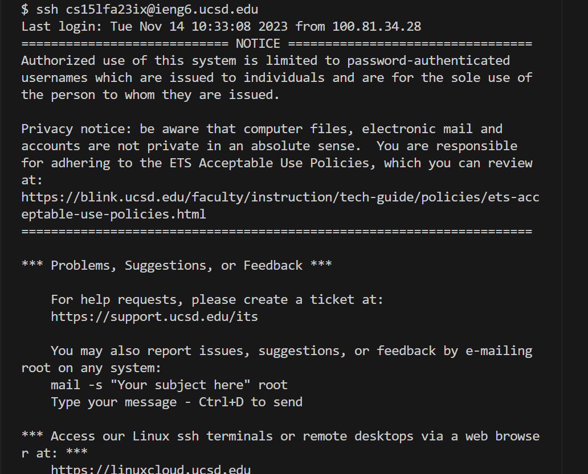
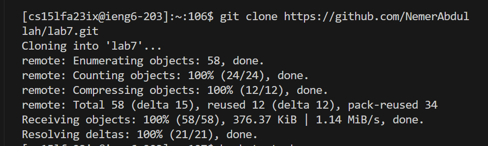
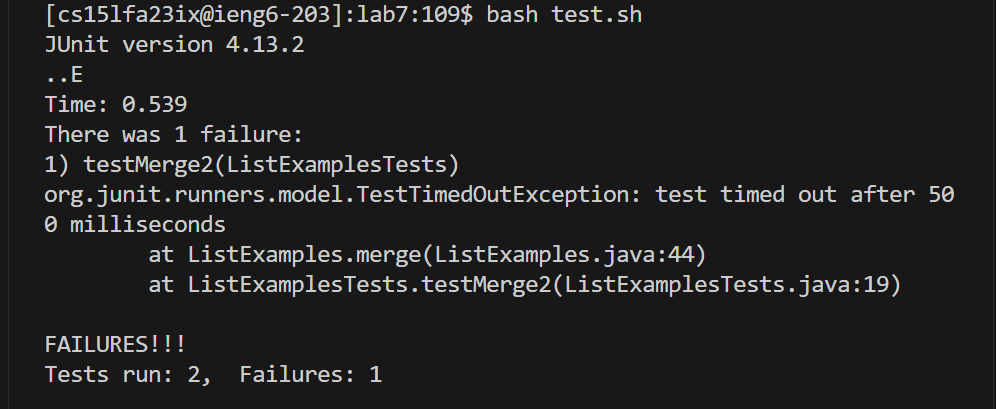
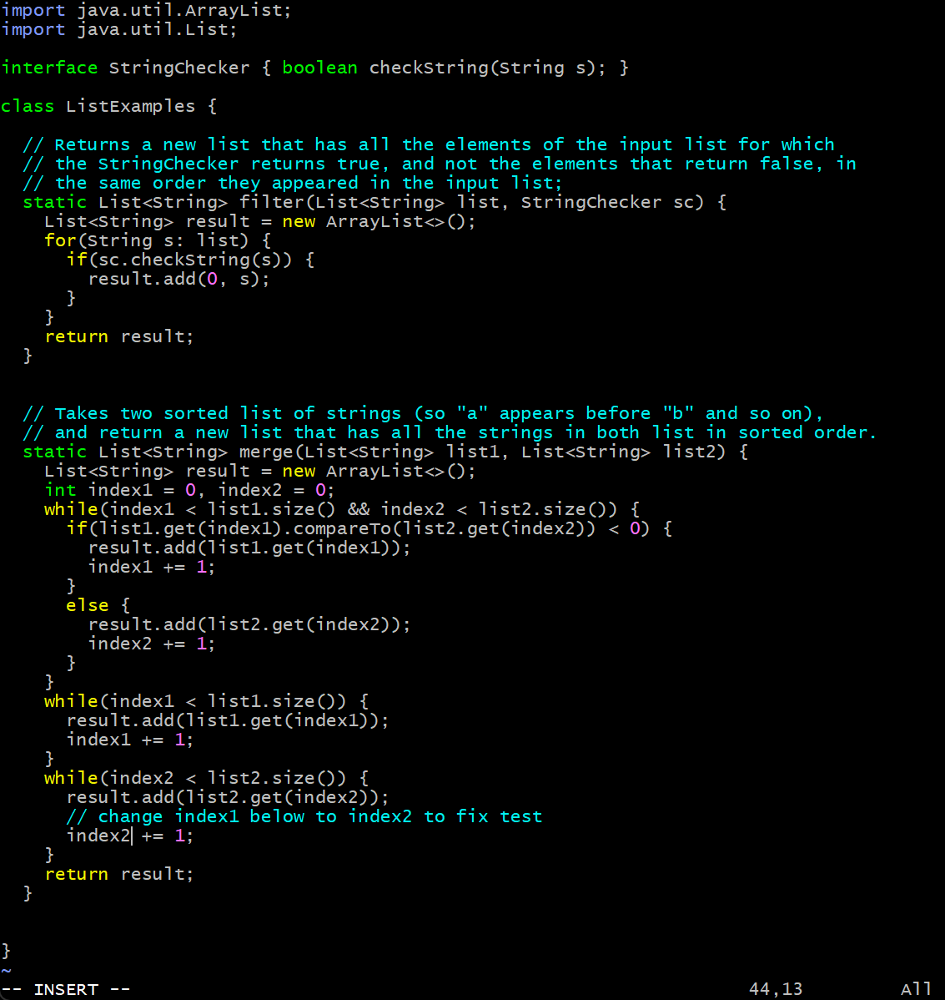
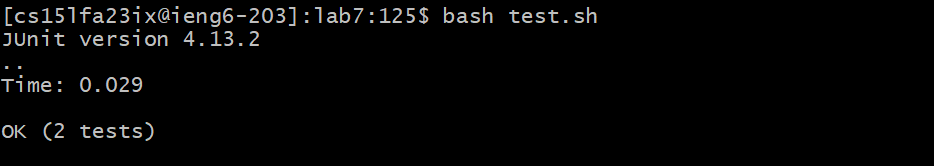
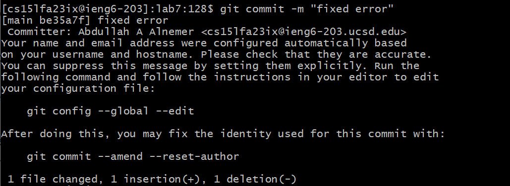
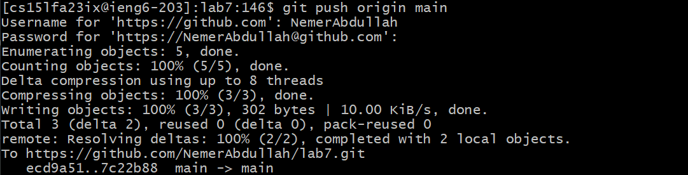

## step 4:

- keys pressed: ssh cse15lfa23ix@ieng6.ucsd.edu
## step5: 

- keys pressed: git clone git@github.com:NemerAbdullah/lab7.git
## step6:

- keys pressed: bash test.sh
## step7:

- vim started in a random location, so I pressed 1000k 1000h so that I started in the top left corner.
- keys pressed: <43j> <12l> < i> "(backspace) 2" <esc> <:wq!> <enter>
- 43j: go down 43 times.
- 12 l: go left 12 times
- i: insert.
- inside insert mode: backspace to delete the one then I replaced it with 2.
- esc: exit insert mode.
- :wq!: save the changes.
- enter: confirm the :wq! action.

file before the change:

file after the change:

## step8:

- keys pressed: bash test.sh

## step9:

- keys pressed: git commit -m "fixed error"

- keys pressed: git push origin main
